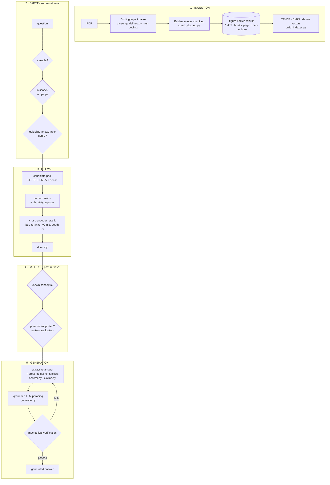

# Nephrolex — architecture

CKD guideline question answering over **KDIGO 2024** and **NICE NG203**, with every
claim traceable to a page and a bounding box in the source PDF.

Every number on this page comes from a generated report in `reports/`, not from
memory. Regenerate with `python scripts/make_eval_report.py`.

---

## The four layers



Safety is deliberately drawn **twice**. It is not a filter bolted to one end of the
pipeline: some questions must be stopped before retrieval runs (a paediatric dosing
question), and others can only be caught after evidence is in hand (a threshold the
guidelines do not contain). Splitting it is the whole reason the system records
0 unsafe answers *and* 0 false declines rather than trading one against the other.

```
nephrolex/
  paths.py                  every filesystem location, resolved once
  ingestion/                parse_guidelines · chunk_docling · build_indexes
  retrieval/                retrieve · colbert · embedding_models
  generation/               answer · claims · generate
  safety/                   scope  (plus the post-retrieval gates in generation/answer)
  evaluation/               build_gold_eval · evaluate_gold
scripts/                    CLI entry points and measurement tools
```

`scripts/` keeps a thin shim for every documented command, so
`python scripts/retrieve.py "..."` still works and carries no logic.

Two details in there are load-bearing rather than tidy-minded:

**`paths.py` exists because the constant was duplicated eight times.** Each core
module resolved the repository root as `Path(__file__).resolve().parents[1]`, which is
correct only while every one of them sits at exactly that depth. Moving them into
layer directories would have repointed all eight at `nephrolex/` — and the corpus,
indexes and gold set would have vanished with no import error to explain it.

**The scoring layer is a registry, not an expression.** `retrieve.SIGNALS` declares
each signal with its weight parameter and how to disable it, and the fused score is a
fold over it. `ablate_components.py` then *enumerates* that registry instead of
restating it. This is not decoration: the hand-written variant list had drifted from
the retriever and was silently testing nothing (below).

---

## Where the quality actually comes from

Leave-one-out, 51 answerable questions, paired bootstrap (`reports/component_ablation.json`):

| Change from the shipped configuration | Δ nDCG@10 | Verdict |
|---|---:|---|
| Remove cross-encoder rerank | −0.0734 | **matters** — the single largest contributor |
| Remove dense retrieval | −0.0710 | **matters** |
| RRF instead of convex fusion | −0.0593 | **matters** |
| Remove chunk-type priors | −0.0502 | **matters** |
| *Add* BM25 back at w=0.30 | −0.0284 | **matters** — it actively hurts, hence w=0.0 |
| Remove TF-IDF | −0.0288 | inside the noise floor |
| Remove query / expansion blend | −0.0277 | inside the noise floor |
| *Add* ColBERT at w=0.30 | −0.0262 | inside the noise floor, and negative |
| Remove metadata signal | −0.0082 | inside the noise floor |
| Remove quality penalty | −0.0069 | inside the noise floor |
| Remove length damping | −0.0003 | inside the noise floor |
| Remove numeric band prior | 0.0000 | **inert** — changes no ranking |

BM25 and ColBERT ship at weight 0.0, so they are tested by switching them **on**;
turning off something already off is the null comparison described below. Both make
the system worse, which is why neither is in the score — BM25 still builds the
candidate pool.

Headline, from `reports/EVALUATION.md`:

| gold set | n | nDCG@10 | recall@10 | recall@20 | MRR@10 |
|---|---:|---:|---:|---:|---:|
| Original code, 51-question set | 51 | 0.2760 | 0.3967 | 0.4900 | 0.2549 |
| Same code, 51-question set | 51 | 0.7280 | 0.8275 | 0.8428 | 0.7302 |
| **Current, 67-question set** | 67 | **0.7074** | **0.8051** | **0.8163** | **0.6940** |

The last two rows are not comparable, and the drop is not a regression. The gold set
grew from 51 to 67 with deliberately harder coverage — paraphrase went from 7 cases to
15, and every new case pins 1–2 chunks rather than up to 5, which removes a confound
but leaves less margin. Both numbers are shown because quoting only the higher one
against the easier set would be the kind of comparison this project exists to avoid.

dev 0.7649 / test 0.6005 on the current set. The original ranker scored 2.56× better
on the slice it was tuned against; that gap is now 1.27×.

---

## Design decisions, and the measurement behind each

**No vector database.** Qdrant was fully ingested and benchmarked, not dismissed. At
1,760 vectors a flat NumPy scan is **0.377 ms** against Qdrant's **17.005 ms**, with
100% identical results — an ANN index has nothing to avoid at this scale, so the
entire difference is transport. `reports/vector_store_benchmark.json`.

**No late interaction.** ColBERT scores 0.5931 alone, and adding it *underneath* the
cross-encoder costs 0.031 nDCG with a bootstrap interval excluding zero: the
cross-encoder already supplies that signal, better. It stays in the tree as a fast
path — 93% of full quality at 8% of the cost — for a CPU demo or a larger corpus.

**No Contextual Retrieval**, and this one was measured the whole way rather than
skipped. 1,501 of 1,523 chunks were given an LLM-generated situating sentence
(Anthropic's method; they report 35% fewer retrieval failures). It made this system
worse (all four rows measured on the 51-question gold set of the time, like for like):

| dense vectors | nDCG@10 | recall@20 | paraphrase (n=7) |
|---|---:|---:|---:|
| **baseline, no context** | **0.7280** | 0.8428 | 0.4455 |
| full context (20.8 words/chunk) | 0.7021 | 0.8324 | 0.3491 |
| generic words stripped (13.7 words) | 0.7051 | 0.8248 | 0.3491 |
| blend 0.9 baseline / 0.1 context | 0.7244 | 0.8477 | 0.4539 |

Overall the loss sits inside the noise floor, but on `paraphrase` — the slice the
technique specifically targets — it is **significantly worse**, mean −0.0964, 95% CI
[−0.1982, −0.0018]. The only significant effect in the comparison points the wrong way.

The mechanism is measurable. Mean pairwise cosine across the corpus rises from 0.6865
to 0.6950: chunks became more alike. Every chunk gained a similar generic sentence —
744 of 1,501 begin "This is..." — so what had been distinguishing signal became
corpus-wide background. Short atomic chunks suffer most: NICE's definition of CKD is
~15 words, so a 21-word prefix more than doubles its length and pulls its embedding
toward the centroid of all contexts. That case degraded by 0.369 *despite* its
generated context being perfectly accurate.

Stripping the generic words barely helped (0.7021 → 0.7051) while down-weighting the
whole context vector recovered nearly everything (0.7244). So the damage is not about
*which* words the context holds — a bi-encoder mean-pools tokens and has no per-word
weight to lower, unlike TF-IDF where IDF neutralises boilerplate automatically. It is
about how much of the final vector is context at all.

The likeliest reason it fails here: **the section path is already indexed.** That
chunk is already searchable under its own heading, which supplies the same situating
information the generated sentence does. Contextual Retrieval was solving a problem
this corpus had already solved in chunking, so it added vector mass without adding
information. The published 35% comes from naively split chunks carrying no structural
metadata; these are evidence atoms carrying section paths and generated questions.

**Safety gates are categorical, never a similarity threshold.** Three attempts to
abstain on a retrieval score failed, and the third explained why: *"How many people
worldwide have CKD?"* scores 0.838 cosine / 1.00 rerank — **above** the median
answerable question. The question is genuinely about CKD and so is the corpus, so
high similarity is correct; what is wrong is the *kind* of information requested.
Similarity cannot express that, so the gates test scope, genre, domain and premise
instead.

**Generation is verified mechanically, not trusted.** A strict grounding prompt is a
request. Afterwards, every citation must resolve and every number-with-unit and every
numeric range must appear verbatim in the evidence the sentence cites — or the
generated text is discarded and the extractive answer shown. 17 adversarial cases in
`check_generation.py` cover hallucinated thresholds, silent unit conversion
(70 mg/mmol → 700 mg/g), averaging two real values into a third, and citing a source
that does not contain the number.

Measured live against `gemini-flash-lite` over 14 gold questions
(`reports/generation_live.json`): **14/14 verified, 0 rejections, mean 3.05 s.**

Getting there required fixing two *false* rejections, which matter as much as false
acceptances — a verifier too strict degrades every answer to extractive while
reporting perfect safety:

- A value the clinician supplied ("filtration rate came back at 38") was rejected as
  unsupported. It now survives if it is in the question **and** inside a range the
  cited evidence states **and** the sentence is not recommending it. All three are
  required: in-range alone would license "aim for 132 mmHg" off NICE's 120–139 target
  range, a recommendation no guideline makes.
- The endpoint of a range ("15 – 29 ml/min") was rejected because the source writes
  the unit in a column header, so "29 ml/min" appears verbatim nowhere. Endpoints
  belong to the range check; re-testing them as standalone thresholds was two checks
  fighting over one number.

Underneath the first sat a plain bug: the lookahead that stops "1.6.1" parsing as a
range also made **any number ending a sentence** invisible.

The safety gates were re-checked with generation enabled, since a generation layer is
exactly the thing that could talk its way past them. All hold, and the scope refusals
return in 0–3 ms — they fire pre-retrieval, so an out-of-scope question never reaches
the model at all.

**Citations are checked against the PDF, not asserted.** Every chunk's stored bounding
box is re-opened in the source PDF and its text compared to the chunk: **99.1%**
(1510/1523) resolve, and all 334 table and figure numbers are read from the document's
own caption rather than our enumeration order. `reports/citation_accuracy.json`.

---

## The ablation checks itself

A leave-one-out table is only worth the configuration behind it. Ours produced a row
reading `without two-guideline coverage … +0.0000`, which looks like strong evidence
that the component is inert. It was not evidence of anything: `retrieve()` defaults
that pass to `False`, and the variant *also* set it to `False`. The row compared the
baseline against itself.

Underneath sat the cause — `retrieve()` defaulted `coverage=False` while both CLIs
overrode it to `True` through a `--no-coverage` store_true flag, which structurally
cannot express "use the function's default". So the headline evaluation and every
direct call had been running different configurations. Every weight now defaults to
`None` at the CLI and the function signature is the single source of truth.

`ablate_components.py` now refuses to let this recur, and distinguishes the two cases
that a naive check would conflate:

| Row state | Meaning |
|---|---|
| `NOT TESTED` | variant configured identically to the baseline — a bug, exits non-zero |
| `inert` | configuration genuinely differs, no ranking moves — a real finding |
| `MATTERS` | change exceeds the paired bootstrap interval |

That distinction matters, because once the coverage pass was configured correctly the
honest answer was still "no effect" — and this time that was a finding rather than a
bug. Enabled against the shipped configuration it changed no ranking on any of the 51
questions, including the 10 requiring both KDIGO and NICE, which is the case it was
written for. **So it was deleted**, along with its parameter and CLI flag; the eval
reproduced 0.7280 to the digit without it, on the gold set of the time. Diversification and the chunk-type priors
were already surfacing both guidelines.

The numeric band prior measures inert for a different reason and was **kept**: with
the cross-encoder active a ×1.1 prior cannot survive the rerank blend, but it is what
makes *"filtration rate came back at 38"* find the GFR band in the demo — behaviour
this metric does not score. Before accepting either conclusion, `numeric_range_signal`
was verified to actually fire (1.000 on four band queries): a signal silently
returning zero looks identical in this table to one that is genuinely inert, and this
codebase has shipped exactly that bug before.

## The evaluation chain has three links, not one

Retrieval metrics measure one hop. This system measures the whole path from PDF to
answer, because each link fails differently and the others cannot see it:

| link | measured by | current |
|---|---|---|
| corpus is faithful to the PDF | `check_corpus.py` | KDIGO 169/169 labelled items present, 0 mislabelled, 0 spliced |
| the right chunk is retrieved | `evaluate_gold.py` | nDCG@10 0.7074, recall@20 0.8163 (67 questions); 100% success@5 on the 20-question clinical FAQ set |
| the right *row* of a table is retrieved | `check_table_rows.py` | 18/19 = 95% correct-row precision |
| the citation resolves to real text | `check_citations.py` | 99.1%, 320 table/figure numbers, 0 wrong |
| the answer states the right value | `check_answers.py` | 72.0% of gold key values reach the reader |
| a fabricated value cannot get through | `check_generation.py` | 22 adversarial cases, 0 leaks |

The fourth row is the one usually missing. nDCG says the chunk was found and citation
accuracy says the citation is real, but neither asks whether the number a clinician
reads is correct. `check_answers.py` extracts the thresholds, bands and categories
from the pinned gold chunk and checks the answer states them - no human judge, no LLM
grader, both of which would be unverifiable here. Its own known flaw is reported with
it: KDIGO prints reference numbers inline, so 1 expectation in 107 (0.9%) is a
reference range rather than a clinical value. The obvious filter was tested and
rejected because it also deleted NICE's real blood-pressure targets.

## Figures are parsed, and references to them resolve

Some guidance carries its content by reference. Practice Point 5.1.1 reads, in full:
*"Refer adults with CKD to specialist kidney care services in the circumstances listed
in Figure 48."* Every criterion is in the figure.

Docling emits a figure as one picture region plus dozens of loose text fragments in no
useful order, which previously fell into whatever narrative passage was open - so the
referral criteria sat scrambled inside an unrelated chunk while the figure itself was
a bare caption. Fragments are now collected by bounding box and ordered top-to-bottom,
left-to-right within a 6pt row band, rebuilding **27 figure bodies**.

Two decisions inside that are worth stating:

- **Numeric plots are excluded.** KDIGO draws both flowcharts carrying criteria
  (Figure 48, 12% numeric) and data heatmaps whose text is axis ticks (Figure 5, 86%
  numeric). Reassembling the second kind produced a 2,457-character wall of hazard
  ratios that matched band queries because it contains "30-44", and was quoted to the
  reader as evidence. Above 35% numeric tokens the body is dropped; the caption still
  describes the figure.
- **References resolve by inclusion, not splicing.** The referenced figure is added as
  evidence in its own right, directly after the chunk that defers to it, and marked
  `resolved from Figure 48`. Merging the text would break both the verbatim quote and
  the bounding box that proves it.

## Ranking is inspectable

Every result carries the per-signal decomposition behind its score:

```
why this ranked:  BM25 0.96  TF-IDF 1.00  dense 1.00  metadata 0.18
                  type prior x1.13  cross-encoder 1.00
```

The same `SIGNALS` registry produces the fused score, the ablation rows and this
display, so what the interface shows is by construction what the ranker did rather
than a description of it maintained separately.

## What the metrics cannot see

The gold set measures whether the right chunk is found. It cannot see whether the
*wrong* chunks look embarrassing, and nearly every defect found by eye during this
build — bounding boxes drawn on the wrong page, table rows sharing one box covering
73% of a page, "Table 6" cited for a table the document calls Table 3, an abbreviation
glossary ranking above guidance — scored as neutral noise on every metric above.

Two consequences shape the architecture:

1. Corpus hygiene is asserted in `build_gold_eval.py`, and a regression **fails the
   build** rather than quietly costing a fraction of a point.
2. A component inside the noise floor is not automatically deleted. The numeric band
   prior measures −0.001, but it is what makes *"filtration rate came back at 38"*
   find the GFR band — a demo moment no metric here scores. Knowing which
   measurements license deletion, and which merely fail to see the effect, is a
   design position rather than an oversight.
